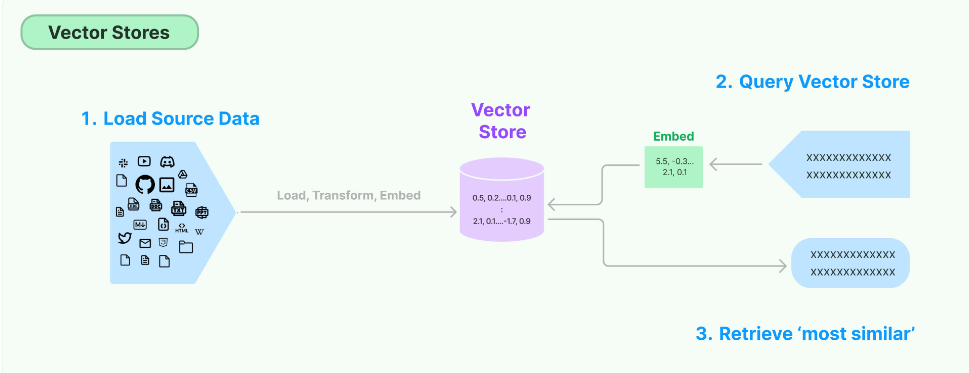
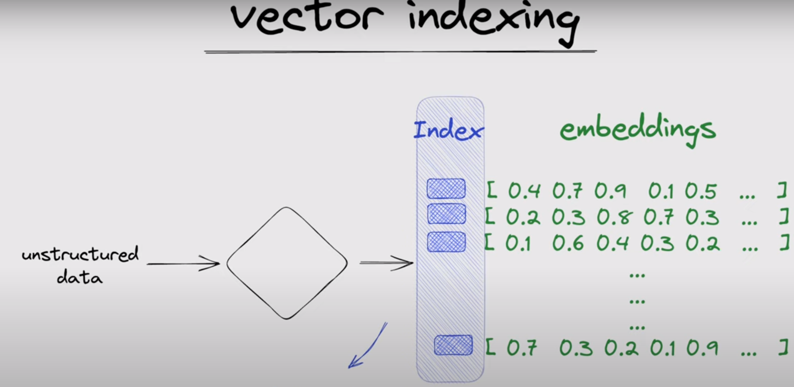

# Natural-language-QA-chatbot
Developing a Q/A chatbot powered by LLMs to provide customer support.

# Outline
* Develop a chatbot capable of responding to inquiries about [Harry Potter books](https://www.kaggle.com/datasets/hinepo/harry-potter-books-in-pdf-1-7/data) using [Langchain](https://python.langchain.com/docs/get_started/introduction).

* Establish a modifiable Retrieval Augmented Generation process to enhance the chatbot's capabilities.
Conduct experiments with various LLMs (Large Language Models)

* Utilize [FAISS](https://python.langchain.com/docs/integrations/vectorstores/faiss) vector storage to hold text embeddings generated with Sentence Transformers from text.

* Summarize the passages that have been retrieved.

* Take advantage of Kaggle's dual GPU (2 * T4) with Hugging Face Accelerate.

* Create a chat UI with Gradio.

# Model
* [wizardLM-7B](https://huggingface.co/TheBloke/wizardLM-7B-HF)
* [llama-2-7b](https://huggingface.co/daryl149/llama-2-7b-chat-hf)
* [llama-2-13b](https://huggingface.co/daryl149/llama-2-13b-chat-hf)
* [Mistral-7B-Instruct](https://huggingface.co/mistralai/Mistral-7B-Instruct-v0.2)

# Flow
## Define Model
1. load the appropriate tokenizer for a given pre-trained model from transformers package
2. loading pretrained models from transformers package
3. set the dtype for the model weights, computation and loading the model weights
4. Defines the maximum length (in tokens) that the language model can handle when generating text or processing input
5. set model in evaluation mode when using PyTorch models.

## [Hugging Face pipeline](https://python.langchain.com/docs/integrations/llms/huggingface_pipelines)
integrate or wrap around functionality(model, tokenizer, temperature, top_p, repetition_penalty,  pad_token_id) within the langchain library.

## Langchain
Multiple document retriever with LangChain

### Loader
load text from multiple PDF files by [langchain.document_loaders](https://python.langchain.com/docs/modules/data_connection/document_loaders/file_directory)

### Splitter
* Splitting the text into chunks so its passages are easily searchable for similarity by [RecursiveCharacterTextSplitter](https://python.langchain.com/docs/modules/data_connection/document_transformers/recursive_text_splitter)

* load and process text chunk by chunk, reducing demands on system resources

### Create Embeddings
*Embedd by [sentence-transformers](https://arxiv.org/pdf/1908.10084.pdf) with LangChain library.

* store the texts in a [Vector database (FAISS)](https://python.langchain.com/docs/modules/data_connection/vectorstores/) with LangChain library.

* the process of generating embeddings from text is a one-time operation; after which, the embeddings can be stored in a vector database. This stored database can then be efficiently used for similarity searches without the need to recreate embeddings again (because Add id to each chunk)

* After saving the vector database, we just load it (vector database) (can search similar vector from vector database with user prompt).

### Prompt Template
Custom prompt with LangChain library (PromptTemplate).

### Retriever chain
* Get the [retriever](https://python.langchain.com/docs/modules/data_connection/retrievers/) from the previously created FAISS index (vector database) with langchain.chains library.
* Returns documents given an unstructured query 
* Vector stores can be used as the backbone of a retriever

## QAbot
wrap retriver, Llm model, customed prompt, return_source_documents(pdf) to a function by RetrievalQA LangChain library.

### Post-process outputs
* Format llm response
** use textwrap to reformat a long text into lines of a fixed width.
 
* Cite sources (PDFs)

## Ask questions
Invoke QA Chain from retriever chain QAbot above.
Talk to your data.

## Gradio Chat UI
* quickly build a UI web application for machine learning model by [gradio]([https://www.gradio.app/guides/quickstart](https://www.gradio.app/guides/creating-a-chatbot-fast)).

* how to use [gradio](https://www.gradio.app/guides/creating-a-chatbot-fast). 

